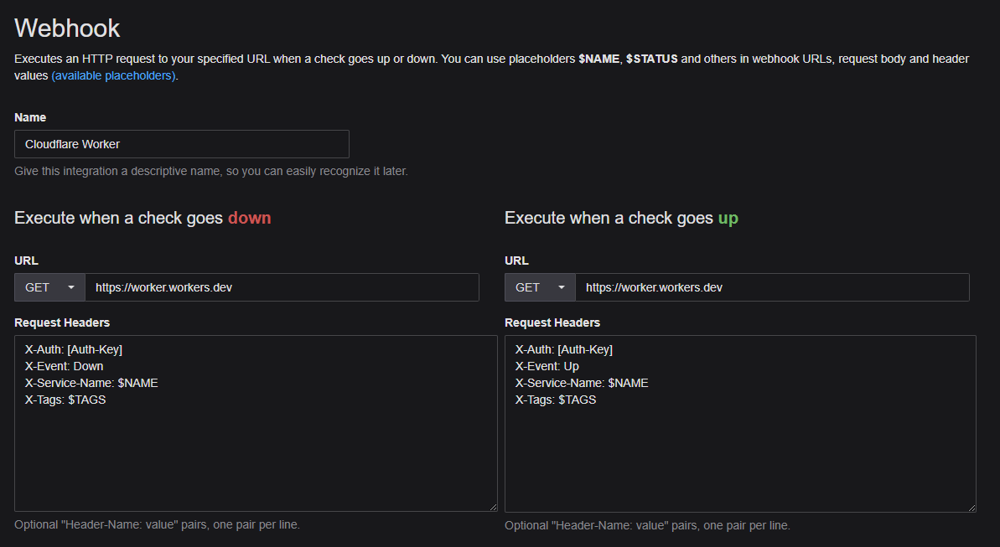

## Downtime Worker

Sends telegram message when webhook with header X-Auth: [WEB_AUTH] is received.  
Uses X-Service-Name, X-Event and X-Tags for more info.  
- `X-Service-Name`: Friendly name of service. E.g.: 'Server'  
- `X-Event`: 'Up' or 'Down'  
- `X-Tags`: Custom tags  

#### Healthchecks
Intended to be used with [healthchecks](https://github.com/healthchecks/healthchecks) webhooks. Configure like this:

### Running

**First!!!** `wrangler login`

#### Set secrets (Environment variables)
Run `wrangler secret put [name]` for each.  
`WEB_AUTH`: Free form token to authorize webhook. Is use a long (>128) base64 key.  
`TELEGRAM_BOT_KEY`: Key from Telegram BothFather. E.g.: `49548951621:a6087sofdzulaisjd_ASDaz789sdgup`  
`TELEGRAM_CHAT_ID`: id of your personal chat with the bot.  
_You can get the key by creating a chat with your bot (Follow BotFather instruction for how-to).
And then query `https://api.telegram.org/bot[key]/getUpdates`_

#### Running Dev Version
*Probably need to set `CF_ACCOUNT_ID` env variable when using more than one account.*  
`wrangler dev`

#### Publish
**Local**  
`wrangler publish`  

**GitHub Actions**  
Set [secrets](../../settings/secrets/actions):  
`CF_ACCOUNT_ID`: Your cloudflare account id  
`CF_API_TOKEN`: Cloudflare api token with at leastworker access rights

#### Logs
`wrangler tail`